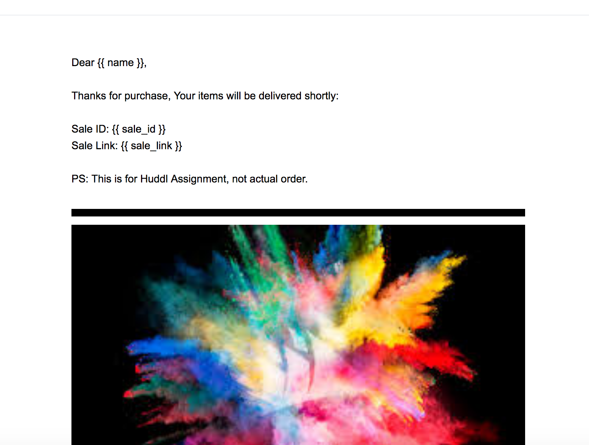
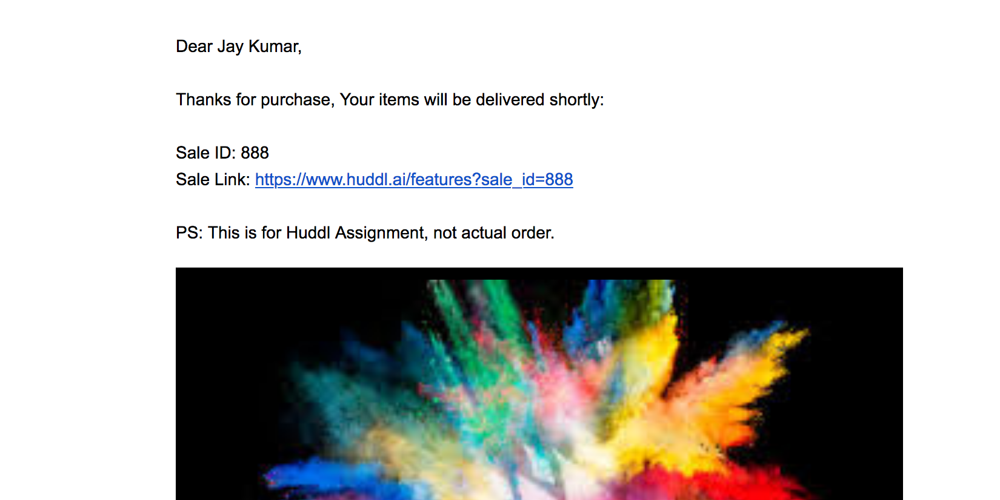

# Email Service

A microservice to send out email to users

---

## Screenshots

### Email Template


### Actual Email 


---

### Pre-requisite

Create a file `.env` with appropriate ENV. VARIABLES Values. Application reads this value while bootstrapping. e.g. Fill the SandGrid API Key and Template Id.

```
SENDGRID_API_KEY=""
NO_REPLY_EMAIL="vs4vijay@gmail.com"
TEMPLATE_SALE_SUMMARY="d-8ee94062b404488094ee4d1b44fb3d0c"
APP_URL="https://www.huddl.ai/features"
SENDER_NAME="Vijay Soni"
```

- Template is provided in `/templates` folder, Please upload it on SandGrid and get the template id

---

## Running

### Run without Docker

- `npm install` OR `yarn`
- `node src/app.js`

### Run with Docker

- `docker build -t email-service .`
- `docker run -p 3333:3333 --env-file=".env" email-service`

---

## Push image to registry

- `docker build -t vs4vijay/email-service .`
- `docker login`
- `docker push vs4vijay/email-service`

---

## API Usage

Request: `POST /api/v1/email`
Body:
```javascript
{
  "email": "vs4vijay@gmail.com",
  "metadata": { 
    "name": "Vijay Soni", 
    "sale_id": "BigBillionDay101"
  }
}
```

Example:
```bash

curl -X POST -d '{"email":"vs4vijay@gmail.com","metadata": {"name":"Jay Kumar","sale_id":123}}'  "http://0.0.0.0:3333/api/v1/email" -H "Content-Type: application/json"

```

---

## To Do

- [x] Basic Node + Express
- [x] Dockerize
- [ ] Run as non-root user
  - [ ] Multistage Build
- [ ] Kubernetes (Good to have)
- [ ] Deploy to Cloud
- [ ] nginx
- [ ] Code
  - [x] Use `yarn` instead of `npm`
  - [ ] Validation and Error Frameworks
  - [x] Enhance the code structure and decouple

---

## Development Notes

```

npm i -D prettier eslint eslint eslint-config-prettier eslint-plugin-prettier

Install ESLint
Install Prettier


printWidth: 80

curl -X POST -d '{"metadata": {}}'  "0.0.0.0:3333/api/v1/email" -v -H "Content-Type: application/json"

curl -X POST -d '{"email":"vs4vijay@gmail.com","metadata": {"name":"Jay Kumar","sale_id":888}}'  "0.0.0.0:3333/api/v1/email" -H "Content-Type: application/json"


```
